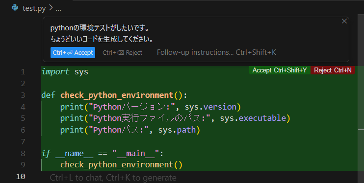
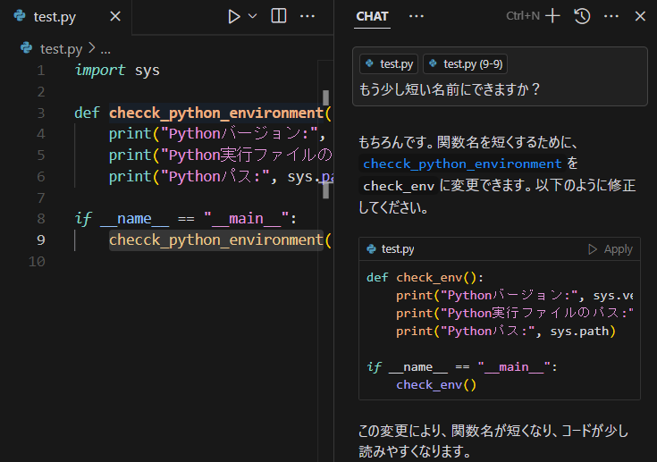
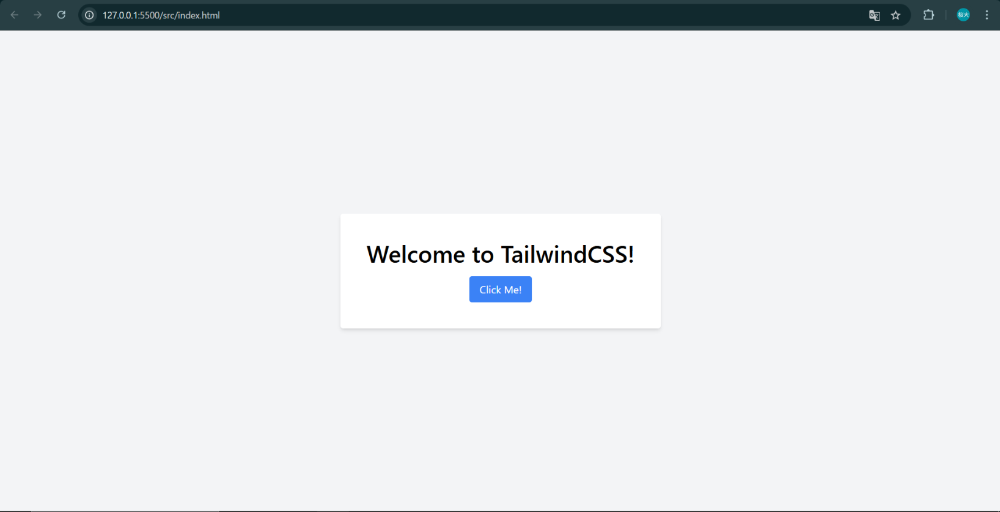

# Web Dev Practice - README

このプロジェクトは、Cursor, Stimulus, TailwindCSSを使用したウェブ開発の練習用リポジトリです。

## ✅ 事前学習で行ったこと

### 🔧 Cursor
- OpenAIのAPI Keyを登録
- 拡張機能から以下をインストール：
  - ESLint
  - Live Server
  - Node.js Modules Intellisense
---

  
コードを生成する例(Python)

チャットからコードを改変する例

### 📦 Stimulus.js
- Node.jsのインストール
- npmからStimulusのインストール

### 🎨 TailwindCSS
- CDNで利用

作ったページ

